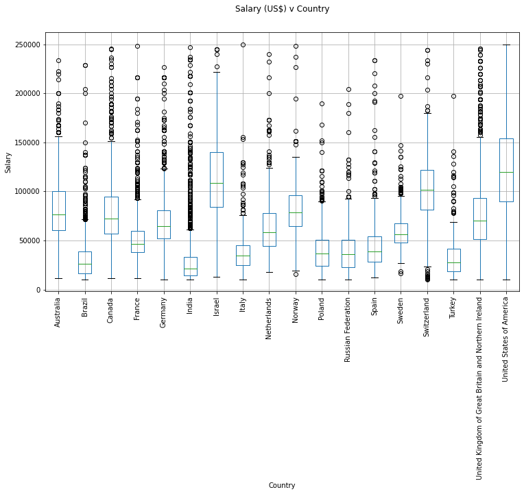

# Developer Salary Predictions
## Author: Elias Dzobo

This  project uses data about software developers to predict an expected salary based on features like location, years of experience etc

### Tech Stack USed
- Python
- Scikit Learn
- Streamlit
- Pandas 
- Plotly


## Installation

Dillinger requires Python and streamlit to run

Install the dependencies and devDependencies and start the server.

```sh
cd Software-Developer-Salary
streamlit run.py
```

